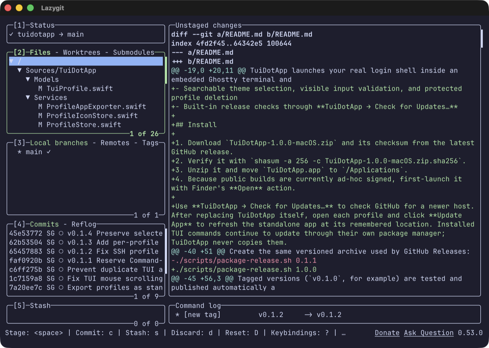
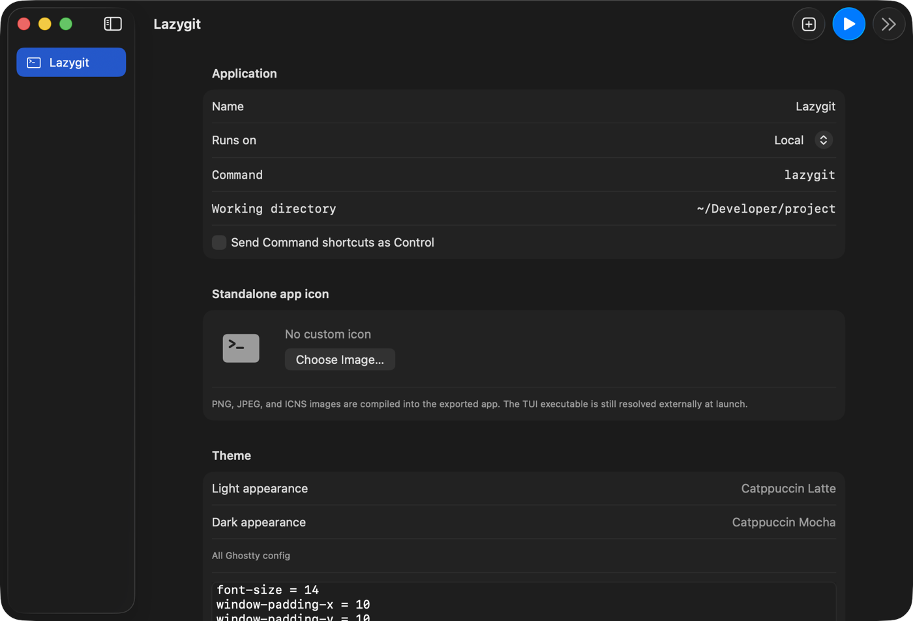
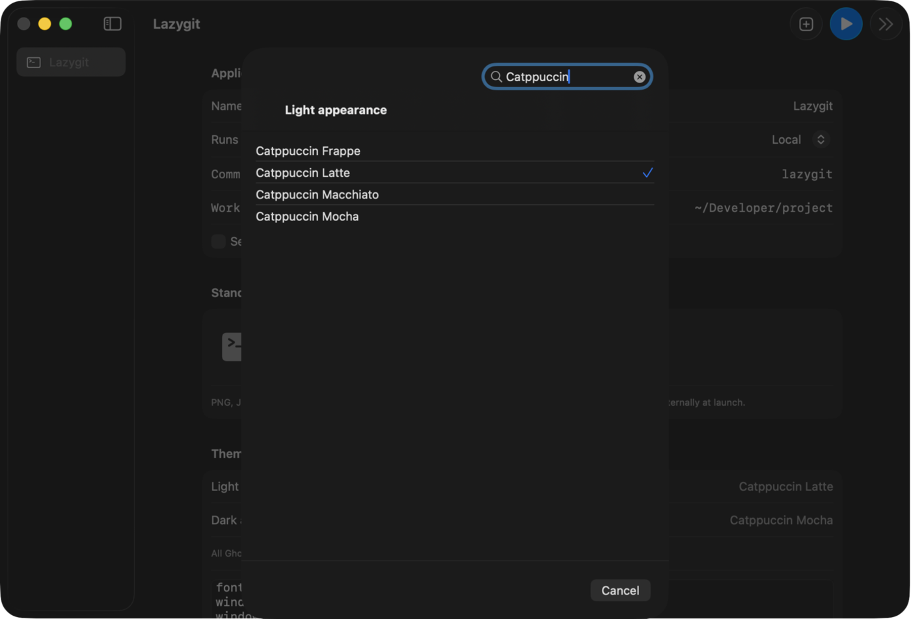

# TuiDotApp

Turn an installed terminal application into a first-class macOS window without copying its binary.

TuiDotApp launches your real login shell inside an embedded Ghostty terminal and injects the configured command as startup input. Homebrew, mise, asdf, shell aliases, SSH agents, and future binary upgrades keep working because the command is resolved when the window opens.

## Screenshots

### A TUI as its own Mac app



### Configure and brand each app



### Search 485 bundled themes



## Current capabilities

- Native macOS profile manager and dedicated terminal windows
- Ghostty rendering, mouse reporting, selection, clipboard, fonts, and configuration
- Native macOS scrollbars with interactive scrollback navigation
- 485 bundled light/dark themes with separate system-appearance choices
- Unfiltered Ghostty config passthrough for options not represented in the UI
- Local commands resolved by the user's login shell
- SSH through `/usr/bin/ssh`, including aliases and policy from `~/.ssh/config`
- No copied or embedded TUI executable
- `tuidotapp://launch/<profile-uuid>` deep links
- Exportable standalone `.app` hosts with independent process, app identity, and icon
- Per-profile PNG, JPEG, or ICNS artwork compiled into a native macOS icon
- Searchable theme selection, visible input validation, and protected profile deletion
- Built-in release checks through **TuiDotApp → Check for Updates…**

## Install

1. Download `TuiDotApp-0.1.5-macOS.zip` and its checksum from the latest GitHub release.
2. Verify it with `shasum -a 256 -c TuiDotApp-0.1.5-macOS.zip.sha256`.
3. Unzip it and move `TuiDotApp.app` to `/Applications`.
4. Because public builds are currently ad-hoc signed, first-launch it with Finder's **Open** action.

Use **TuiDotApp → Check for Updates…** to check GitHub for a newer host. After replacing TuiDotApp itself, open each profile and click **Update App** to refresh the standalone app at its remembered location. Installed TUI commands continue to update through their own package manager; TuiDotApp never copies them.

## Build

Requirements: macOS 14+, Xcode 16+ and Swift 6.

```bash
swift test
swift run tuidotapp
```

Build an ad-hoc signed app bundle:

```bash
./scripts/build-app.sh
open dist/TuiDotApp.app
```

Create the same versioned archive used by GitHub Releases:

```bash
./scripts/package-release.sh 0.1.5
```

Tagged versions (`v0.1.0`, for example) are tested and published automatically as a macOS app archive plus SHA-256 checksum. Release archives are ad-hoc signed until a Developer ID certificate is configured, so macOS may require the first launch through Finder's **Open** action.

After opening TuiDotApp once, use **Create App…** on a profile to create a signed standalone app for Applications, Spotlight, and the Dock. Each exported app has its own bundle identity, process, menu-bar name, and optional custom icon. It embeds the reusable TuiDotApp/Ghostty host and the profile UUID, never the configured command or TUI executable, so upgrading the externally installed command takes effect on the next launch.

Profile settings remain in `~/Library/Application Support/TuiDotApp/profiles.json`, so an exported app is standalone on the Mac that created it rather than portable to another Mac. Profile edits apply on the next launch. TuiDotApp remembers the created app's location: after updating TuiDotApp itself, click **Update App** to refresh its embedded terminal host. The old app remains intact if replacement fails.

Choose **Choose Image…** in the profile editor before export to use PNG, JPEG, or ICNS artwork. TuiDotApp stores a durable copy under Application Support and generates all required macOS icon sizes during export.

## How launching works

1. TuiDotApp creates a Ghostty terminal surface.
2. Ghostty starts the user's login shell (`$SHELL`, passwd entry, then `/bin/zsh`).
3. A short startup-input file tells that shell to `exec` the configured command.
4. The command is resolved from the live shell environment. Its executable is never copied into the app.
5. Closing the command closes its terminal window and removes the startup-input file.

An exported profile app performs this sequence inside its own process. It reads the profile UUID from its bundle, loads the current profile from Application Support, and hosts Ghostty directly; it does not redirect into a shared TuiDotApp process.

For SSH profiles, the startup command is `/usr/bin/ssh -tt`. Authentication, host keys, ProxyJump, identities, ports, and agent behavior remain OpenSSH concerns. Prefer named hosts in `~/.ssh/config`; use the additional arguments field only for one-off flags. TuiDotApp advertises `TERM=xterm-256color` for remote sessions so a missing `xterm-ghostty` terminfo entry cannot silently corrupt a remote TUI.

## Themes and Ghostty configuration

Each profile has independent light and dark themes. The advanced text field accepts normal Ghostty `key = value` configuration. Unknown keys pass through rather than being dropped.

TuiDotApp reserves these options because they control process lifecycle:

- `command`
- `input`
- `shell-integration`
- `quit-after-last-window-closed`

## Security

TuiDotApp intentionally does not sandbox commands. A TUI launched here has the same access it would have in your normal terminal. SSH uses the system OpenSSH binary and does not collect passwords, private keys, or agent credentials.

## License

TuiDotApp is MIT licensed. It uses `libghostty-spm`, which packages Ghostty technology under its respective upstream licenses.
